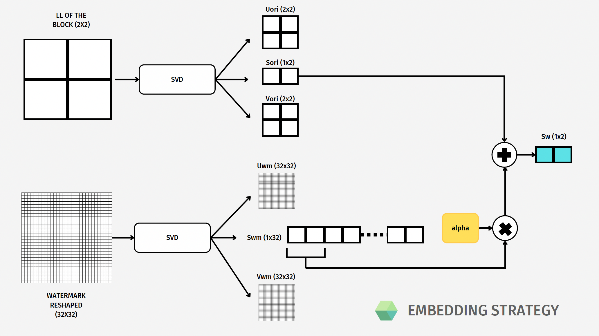

# DWT-SVD-digital-watermarking
Repository related to the Catch the Mark competition of the **Multimedia Data Security** graduate course of University of Trento, academic year 2022/2023.
  
Group name: **howimetyourmark**

Final mark: **30/30**

Contributors:
+ Leonardo Vicentini - [vicentinileonardo](https://github.com/vicentinileonardo)
+ Matteo Darra - [MatteoDarra](https://github.com/MatteoDarra)
+ Sofia Zanrosso - [sofiazanrosso](https://github.com/sofiazanrosso)
+ Roberta Bonaccorso - [robi00](https://github.com/robi00)

## Directory structure
+ `embedding_howimetyourmark.py` - contains the source code of the embedding algorithm
+ `detection_howimetyourmark.py` - contains the source code of the detection algorithm, used to retrieve and compare the watermark previously embedded
+ `attacks.py` - contains the source code of the attacks used to test the robustness of the watermarking algorithm and to attack other groups' watermarked images
+ `tester.py` - contains a simple tester script to test the embedding and detection algorithms
+ `tester2.py` - contains a more complex tester script to test the embedding and detection algorithms
+ `roc_howimetyourmark.py` - contains the source code for calculating the ROC curves of the detection algorithm
  
+ `ROC.png` - contains an example of a ROC curve
+ `utilities folder` - contains original and watermaked images used during the challenge, a `.csv` file used to compute the WPSNR metric and the watermark assigned to our group and 
+ `sample_images` - contains sample images used to compute the ROC curves
+ `test_images` - contains images used to test the detection algorithms
+ `attacked_images` - contains attacked images starting from other groups' watermarked images
+ `howimetyourmark.pdf` - contains the presentation of the group with the final outcomes

## How to run the code (TODO)
### Embedding
### Detection
### ROC curves
### Testing
### Attacks

## Strategy adopted

We initially based our method on existing papers, searching for new methodologies to embed a watermark in a **robust** and **invisible** way. 

We found out that various researchers implemented a hybrid strategy involving **Discrete Wavelet Transform**, that we have seen during the course, and **Singular Value Decomposition**, which is a method for matrix factorization.

Of the mentioned papers, we did not take into account the security features that were not relevant for the challenge. 

Another major difference with the majority of the paper analyzed was that they directly used the watermark in the detection so a workaround compliant with the rules was needed.

Another main difference between our methods and the mentioned papers is a different **preprocessing** methodology. The mentioned papers proposed edge detection as the method for the selection of the best N block to embed. 

We decided to go for a different approach, we therefore ranked all the blocks based on a “**merit**” which was calculated with a **preliminary attack phase** against the original image and using a **spatial function** like average or median. This phase allowed us to determine which parts of the image were less prone to be attacked with the aim of placing our mark in that specific position.

The general flow of our embedding strategy, starting from the original image and the watermark, can be seen in this flowchart:

The major steps are: 
1. Selection of blocks based on “merit”
2. DWT and SVD of the blocks, 
3. SVD of the reshaped watermark, 
4. Sum of S components which is done by summing the S component of the original image and the S component of the watermark, with a scaling factor alpha 
5. Reconstruction of the image using inverse SVD and inverse DWT.

One additional step, peculiar to our method, is to add a **mask** of white blocks calculated in the preprocessing as a final step before returning the watermarked image; this will be helpful during the detection phase.

Focusing on the embedding step, with the help of this scheme:

Here we applied the DWT decomposition of a single block. 
We take only the LL and apply the singular value decomposition.
We reshape the watermark and apply the SVD also here.
Then we are ready to sum only the 2 S components returned by the SVD.
Since the S component of the watermark is always of length 32 we need to do this sum only for 2 values for each block (eg: in the first block we embed only the first 2 values of the S component of the watermark). 
In this way with our method we can embed more than one watermark, so achieve **redundancy**, if needed, just by increasing the number of blocks to embed.

The extraction of the watermark is performed as follows:
1. First of all we have to reconstruct the mask which allows us to recover the locations of the watermarked blocks. The addition of the mask isn’t necessary to recover the locations. We could simply have performed the same preprocess used in the embedding, but it would have taken more than five seconds.
2. Then we perform the DWT on the blocks in the recovered locations of the watermarked image and original image (one by one).
3. Then we apply the SVD on the LL of the selected block (both in the original and watermarked image), and we keep the S matrix of both.
4. We reconstruct the S matrix of the watermark by computing the difference between the S matrix of the watermarked block and the S matrix of the original block divided by alpha [scaling factor] (Swm = Swatermarked - Soriginal)/alpha
5. Now we can reassemble the  original watermark by doing the inverse of the SVD.

In order to perform the inverse of the SVD in the detection we needed the other 2 components of the SVD of the watermark (so U and V). So, we pre-calculated those 2 components and we hardcoded it in the detection code, after being reassured that it was allowed by the rules of the competition. 

The papers analyzed instead used directly the watermark in the detection code.

## Results (TODO)

### Defense phase
We managed to achieve the **second best embedding quality** (average WPSNR = 66.03) among all the groups participating in the challenge.
The **robustness** achieved was among the **second bests (ex aequo)** as well.

### Attack phase
The attack phase has been quite successful, as we managed to **attack 10 out of 10 groups**, with a **success rate of 93.3%** for the 30 images involved.
**Parallelization** has been used to speed up the attack phase, as it is quite time-consuming. 
In particular, we exploited Google Colab, **Azure IaaS with 1 VM** and local machines.

## References
+ [1] - [Murty, Pattisapu & Kumar P, Rajesh. (2013). Towards Robust Reference Image Watermarking using DWT- SVD and Edge Detection. International Journal of Computer Applications. 68. 10-15. 10.5120/11606-6975.](https://www.researchgate.net/publication/304201204_Towards_Robust_Reference_Image_Watermarking_using_DWT-_SVD_and_Edge_Detection)
+ [2] - [Alzahrani, A. (2022). Enhanced Invisibility and Robustness of Digital Image Watermarking Based on DWT-SVD. Applied Bionics and Biomechanics, 2022, 5271600. doi:10.1155/2022/5271600](https://www.hindawi.com/journals/abb/2022/5271600/)
